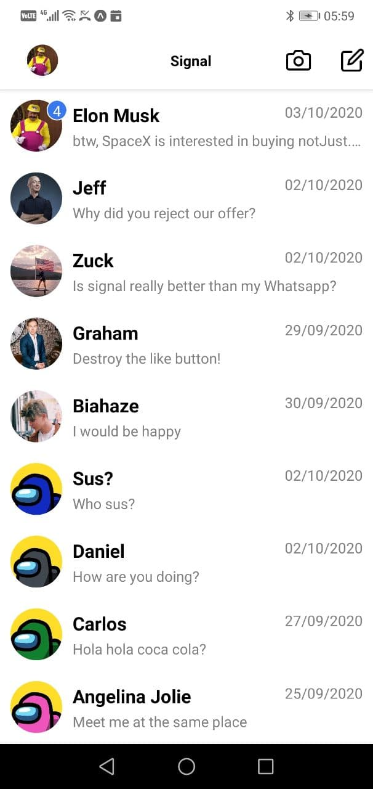

# SignalClone

A Signal app clone built using React Native.

## Table of contents

- [Overview](#overview)
  - [Screenshot](#screenshot)
  - [Links](#links)
- [My process](#my-process)
  - [Built with](#built-with)
  - [Continued development](#continued-development)
- [Author](#author)
- [Acknowledgments](#acknowledgments)

## Overview

### Screenshot

### Links

- Solution URL: [Click here](https://github.com/Bluette1/SignalClone)

## My process

### Built with

- Typescript
- React Native
- CSS
- Expo

### Continued development

This is a work in progress. The backend still needs to be added.

## Author

- Website - [Marylene Sawyer](http://www.marylene.tech/)
- GitHub - [@Bluette1](https://github.com/Bluette1)
- Twitter - [@MaryleneSawyer](https://twitter.com/MaryleneSawyer)

## Acknowledgments

Link to the tutorial: [Click Here](https://www.youtube.com/watch?v=uciWe9TvWf8)

